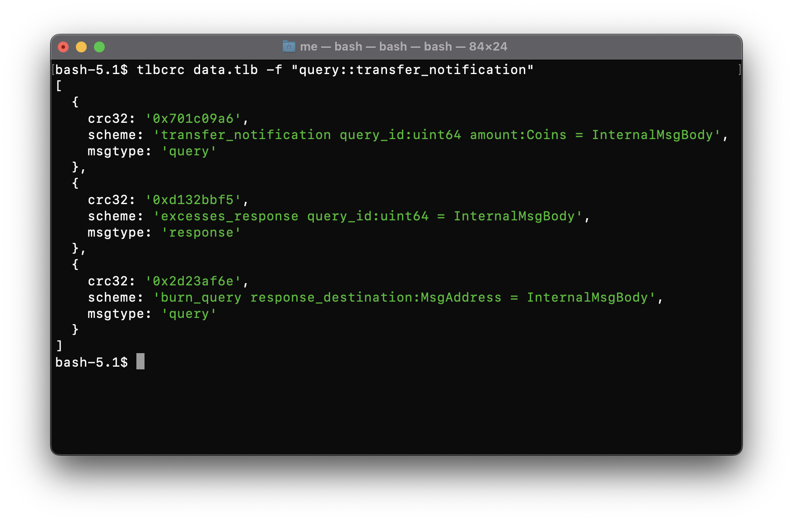

# tlbcrc


[](https://ton.org/)
[](https://github.com/delab-team/tlbcrc/blob/main/LICENSE)

Package & CLI to generate op's by tl-b



## Install

- as global cli package
```
yarn global add @delab-team/tlbcrc
```

- as local project package
```
yarn add @delab-team/tlbcrc
```
